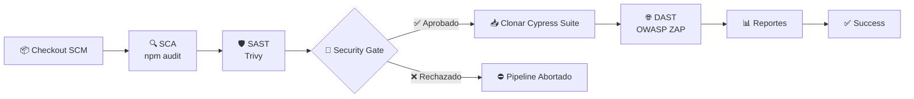

# 🚀 Jenkins DevSecOps Pipeline Orchestrator

<div align="center">

# 🛡️ Security by Design

### Pipeline Declarativo DevSecOps con Security Gates Automatizados

<p align="center">
Integrando seguridad desde el primer commit hasta la publicación de resultados.
</p>

<br>


</div>

---

## 🎯 ¿Qué es este proyecto?

Este repositorio implementa un pipeline **DevSecOps completo** donde la seguridad se convierte en un criterio obligatorio antes de avanzar a las siguientes etapas del ciclo de integración continua.

La filosofía aplicada es:

> **Fail Fast • Fail Secure**

Si se detectan vulnerabilidades críticas o de alto riesgo, el pipeline se detiene automáticamente evitando consumir recursos innecesarios y reduciendo el riesgo de despliegues inseguros.

---

## ✨ Características Principales

* 🔍 Escaneo de dependencias (SCA)
* 🛡️ Análisis estático de seguridad (SAST)
* 🚦 Security Gate automatizado
* 🌐 Escaneo dinámico (DAST)
* 📊 Publicación automática de reportes
* 🐳 Ejecución totalmente contenedorizada
* ⚡ Detección temprana de riesgos

---

## 📊 Métricas del Pipeline

| Indicador             | Valor           |
| --------------------- | --------------- |
| ⏱ Tiempo Promedio     | 4.5 min         |
| 🛡 Capas de Seguridad | 3               |
| 🚫 Bloqueo Automático | HIGH + CRITICAL |
| 🐳 Entorno            | Docker          |
| 📈 Tipo de Pipeline   | Declarativo     |

---

# 🏛️ Arquitectura General



---

# 🔄 Flujo DevSecOps

| Etapa           | Herramienta | Objetivo                       |
| --------------- | ----------- | ------------------------------ |
| SCA             | npm audit   | Dependencias vulnerables       |
| SAST            | Trivy       | Análisis de código             |
| Security Gate   | Groovy      | Evaluación de riesgos          |
| E2E Preparation | Git Clone   | Obtención de pruebas           |
| DAST            | OWASP ZAP   | Pruebas de seguridad dinámicas |
| Reporting       | Jenkins     | Publicación de resultados      |

---

# 🚦 Security Gate

El componente más importante del pipeline.

Analiza el reporte generado por Trivy y toma decisiones automáticas según la severidad encontrada.

```groovy
def vulnerabilities = readJSON file: 'trivy-report.json'

def criticalCount = vulnerabilities.Results?.sum {
    it.Vulnerabilities?.count {
        v -> v.Severity == 'CRITICAL'
    } ?: 0
}

if (criticalCount > 0) {
    error "🛑 SECURITY GATE ACTIVADO"
}
```

## Reglas Aplicadas

| Severidad   | Acción      |
| ----------- | ----------- |
| 🔴 CRITICAL | Bloquear    |
| 🟠 HIGH     | Bloquear    |
| 🟡 MEDIUM   | Advertencia |
| 🔵 LOW      | Permitir    |

---

# 📸 Evidencias Reales

## ✅ Pipeline Exitoso

<p align="center">


<br><br>


<br><br>


</p>

---

## ❌ Pipeline Bloqueado

<p align="center">


</p>

### Resultado

El Security Gate detectó vulnerabilidades críticas y evitó:

* Ejecución innecesaria de DAST
* Consumo de recursos
* Falsos despliegues exitosos
* Riesgos de seguridad en producción

---

# ⚙️ Instalación

## Requisitos

```yaml
Docker: 24+
Jenkins: LTS
RAM: 4 GB mínimo
CPU: 2 vCPU
```

---

## Plugins Jenkins

| Plugin                 |
| ---------------------- |
| Pipeline Utility Steps |
| Docker Pipeline        |
| Git Plugin             |

---

## Ejecución

```bash
# Levantar Jenkins

docker-compose up -d

# Instalar plugins

# Crear Pipeline desde SCM

# Ejecutar Build Now
```

---

# 🌎 Ecosistema del Proyecto

Este repositorio forma parte de una solución más amplia.

| Repositorio                | Función               |
| -------------------------- | --------------------- |
| Cypress E2E Suite          | Pruebas automatizadas |
| Jenkins DevSecOps Pipeline | Orquestador principal |

### Integración Dinámica

Durante la ejecución, Jenkins clona automáticamente la suite E2E para garantizar que siempre se utilicen las pruebas más recientes.

---

# 🚀 Roadmap

## Próximas Mejoras

* [ ] Integración con SonarQube
* [ ] Escaneo de secretos (Gitleaks)
* [ ] Integración con Slack
* [ ] Integración con Microsoft Teams
* [ ] Almacenamiento de reportes en S3
* [ ] Pipeline parametrizado
* [ ] Multibranch Pipelines

---

# 🤝 Contribuciones

Las contribuciones son bienvenidas.

Si encuentras oportunidades de mejora, abre un Pull Request o un Issue.

---

# 📄 Licencia

MIT License

---

# 👨‍💻 Autor

<div align="center">

## Herberth Daniel Barrios

DevOps Engineer Student • DevSecOps Practitioner


</div>

---

<div align="center">

### 💡 "El mejor código es el que nunca llega a producción con vulnerabilidades críticas."

</div>
