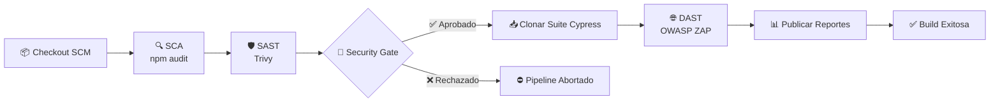
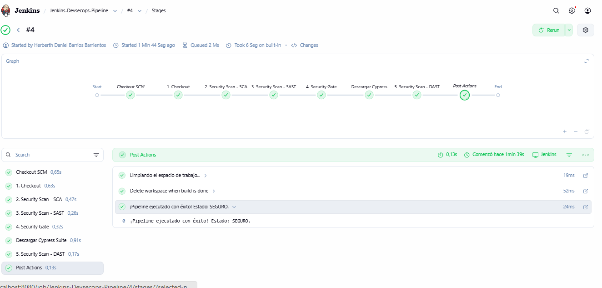
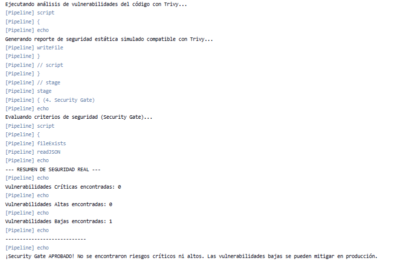
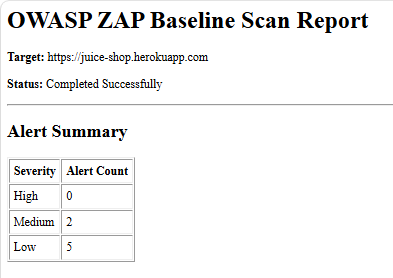
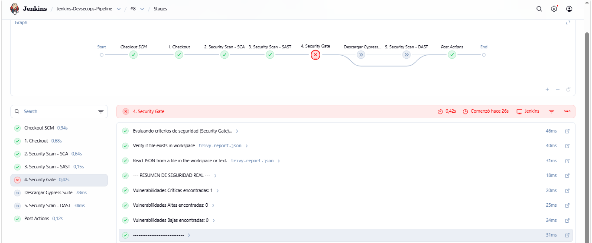

<div align="center">

# 🛡️ Jenkins DevSecOps Pipeline Orchestrator

### Security by Design • Fail Fast • Fail Secure

Pipeline declarativo construido sobre Jenkins que integra **SCA, SAST, DAST y Security Gates automatizados** para detener vulnerabilidades antes de que lleguen a producción.

<br>


</div>

---

## 🎯 Acerca del Proyecto

Este proyecto implementa una estrategia moderna de **DevSecOps**, donde la seguridad deja de ser una actividad posterior al desarrollo y se convierte en un requisito obligatorio dentro del pipeline de integración continua.

Cada commit es validado mediante múltiples capas de seguridad antes de permitir que el flujo continúe.

> **Objetivo:** detectar riesgos lo antes posible para reducir costos, evitar despliegues inseguros y optimizar el uso de recursos.

---

## ✨ Características Principales

✅ Escaneo de dependencias vulnerables (SCA)

✅ Análisis estático de seguridad (SAST)

✅ Security Gate automatizado basado en severidad

✅ Escaneo dinámico de aplicaciones (DAST)

✅ Publicación automática de reportes

✅ Pipeline completamente dockerizado

✅ Automatización de pruebas E2E

✅ Filosofía *Fail Fast, Fail Secure*

---

# 📊 Métricas del Pipeline

| Indicador                      | Valor           |
| ------------------------------ | --------------- |
| ⏱ Tiempo promedio de ejecución | ~4.5 min        |
| 🛡 Capas de seguridad          | 3               |
| 🚦 Security Gate               | HIGH + CRITICAL |
| 🐳 Entorno                     | Docker          |
| 🔄 Tipo de Pipeline            | Declarativo     |
| 📋 Reportes                    | Automatizados   |

---

# 🏗️ Arquitectura General



---

# 🔄 Flujo DevSecOps

| Etapa         | Herramienta | Objetivo                          | Resultado             |
| ------------- | ----------- | --------------------------------- | --------------------- |
| Checkout      | Git         | Obtener código fuente             | Workspace             |
| SCA           | npm audit   | Detectar dependencias vulnerables | Consola               |
| SAST          | Trivy       | Análisis estático de seguridad    | trivy-report.json     |
| Security Gate | Groovy      | Evaluar riesgo                    | Continuar o detener   |
| E2E Setup     | Git Clone   | Obtener suite de pruebas          | Workspace actualizado |
| DAST          | OWASP ZAP   | Simulación de ataques             | zap-report.html       |
| Reporting     | Jenkins     | Consolidar resultados             | Dashboard             |

---

# 🚦 Security Gate

El corazón del pipeline.

Esta etapa analiza automáticamente el reporte generado por Trivy y toma decisiones basadas en la severidad encontrada.

```groovy
def vulnerabilities = readJSON file: 'trivy-report.json'

def criticalCount = vulnerabilities.Results?.sum {
    it.Vulnerabilities?.count {
        v -> v.Severity == 'CRITICAL'
    } ?: 0
}

if (criticalCount > 0) {
    error "🛑 SECURITY GATE ACTIVADO"
}
```

## Política de Seguridad

| Severidad   | Acción            |
| ----------- | ----------------- |
| 🔴 CRITICAL | Bloquear Pipeline |
| 🟠 HIGH     | Bloquear Pipeline |
| 🟡 MEDIUM   | Advertencia       |
| 🔵 LOW      | Permitir          |

---

# 📸 Evidencias

## ✅ Pipeline Exitoso

### Stage View

<p align="center">

</p>

### Security Gate

<p align="center">

</p>

### OWASP ZAP Report

<p align="center">

</p>

---

## ❌ Pipeline Bloqueado

### Vulnerabilidades detectadas

<p align="center">

</p>

### Resultado

El pipeline fue detenido automáticamente antes de ejecutar etapas posteriores.

Esto evita:

* Consumo innecesario de recursos
* Ejecución de pruebas sobre código inseguro
* Reportes irrelevantes
* Posibles despliegues vulnerables

---

# 🛠️ Stack Tecnológico

| Categoría            | Tecnología |
| -------------------- | ---------- |
| CI/CD                | Jenkins    |
| Contenedores         | Docker     |
| Control de versiones | Git        |
| SCA                  | npm audit  |
| SAST                 | Trivy      |
| DAST                 | OWASP ZAP  |
| Automatización E2E   | Cypress    |
| Lenguaje Pipeline    | Groovy     |

---

# ⚙️ Requisitos

```yaml
Docker: 24+
Jenkins: LTS

RAM mínima:
  - 4 GB

CPU mínima:
  - 2 vCPU
```

---

# 🚀 Instalación Rápida

## 1️⃣ Levantar Jenkins

```bash
docker-compose up -d
```

## 2️⃣ Instalar Plugins

* Pipeline Utility Steps
* Docker Pipeline
* Git Plugin

## 3️⃣ Crear Pipeline

```text
New Item
 → Pipeline
 → Pipeline Script from SCM
 → Seleccionar este repositorio
 → Branch: main
```

## 4️⃣ Ejecutar

```text
Build Now
```

---

# 🌐 Ecosistema del Proyecto

Este repositorio forma parte de una solución distribuida orientada a automatización y calidad de software.

| Repositorio                | Función               |
| -------------------------- | --------------------- |
| Cypress E2E Suite          | Pruebas automatizadas |
| Jenkins DevSecOps Pipeline | Orquestador principal |

### Integración Dinámica

Durante la ejecución del pipeline se clona automáticamente la suite E2E para garantizar que siempre se utilice la versión más reciente de las pruebas.

---

# 📈 Roadmap

## Próximas Mejoras

* [ ] Integración con SonarQube
* [ ] Integración con Slack
* [ ] Integración con Microsoft Teams
* [ ] Escaneo de secretos con Gitleaks
* [ ] Publicación de reportes en S3
* [ ] Multibranch Pipelines
* [ ] Caché de dependencias
* [ ] Pipeline parametrizado

---

# 🤝 Contribuciones

Las contribuciones son bienvenidas.

Si encuentras una mejora o deseas colaborar:

1. Fork del proyecto
2. Crear rama de trabajo
3. Commit de cambios
4. Pull Request

---

# 📄 Licencia

Distribuido bajo licencia MIT.

Consulta el archivo **LICENSE** para más información.

---

<div align="center">

# 👨‍💻 Autor

### Danielito2252

**DevOps Engineer Student • DevSecOps Practitioner**

*"El mejor código es el que nunca llega a producción con vulnerabilidades críticas."*

</div>
